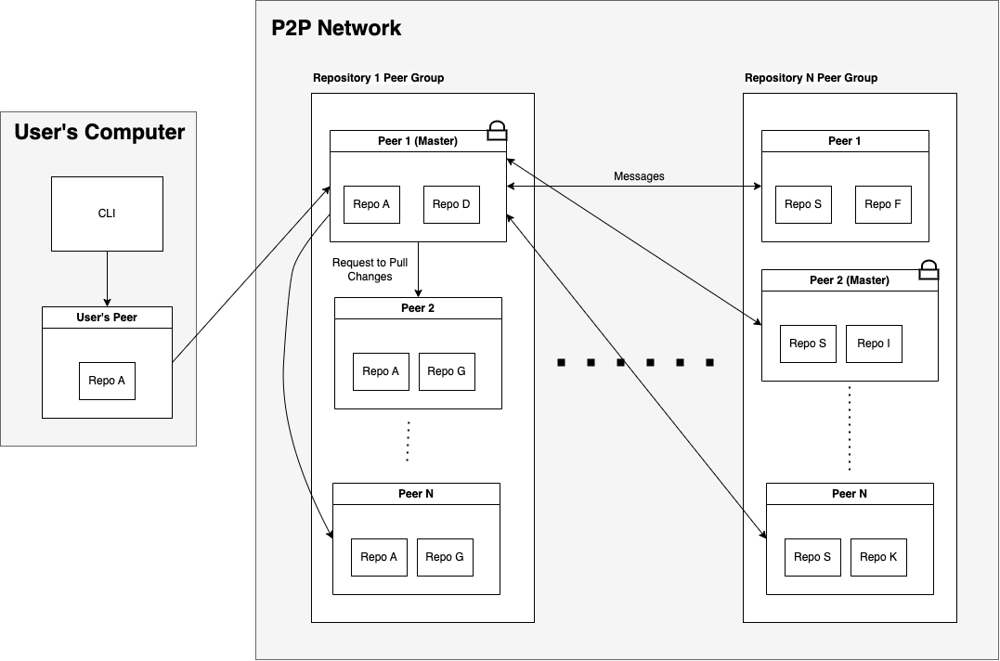
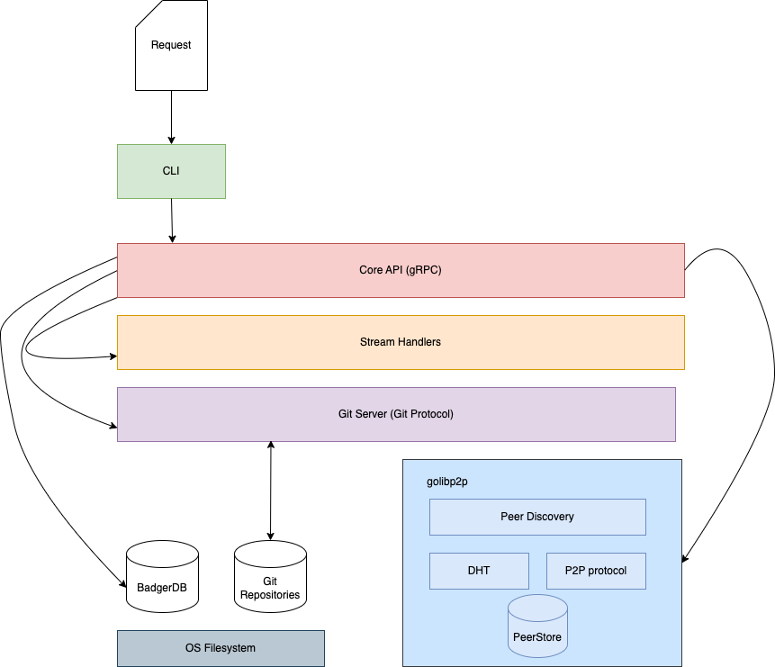
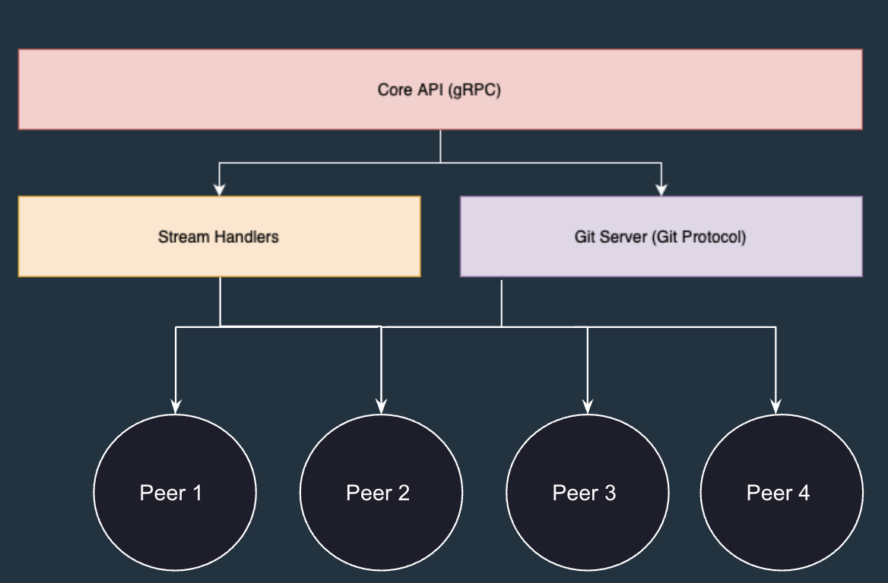
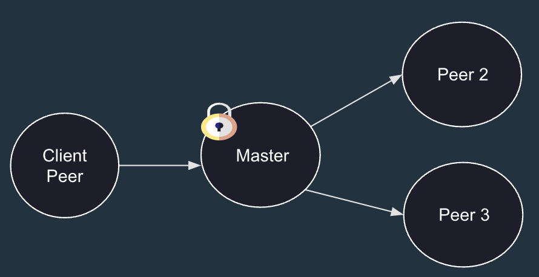
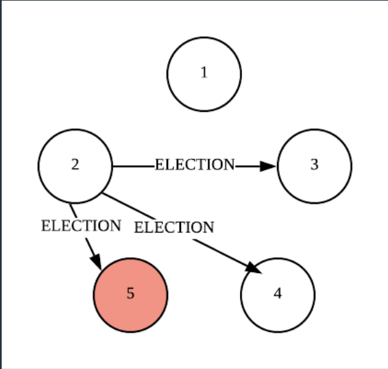

# P2P Code Collaboration Application

## Overview
This project is a code collaboration tool simialr to Github except it runs on a on a peer-to-peer (P2P) distributed network architecture. It is built using Go and the libp2p framework.

### Overall Architecture
Peer Groups:
- Each repository is stored on a group of N nodes.
- Each Peer group has a leader and a lock.




### Communication Model

- gRPC Server: The core API of the network that handles requests such as repo initialization and lock acquisitions through remote procedure calls.

- Stream Handlers: Built over TCP, facilitate communication between the peers in the network.

- Git Daemon: Uses the git protocol for various features such as push and pull.

- BadgerDB: Acts as a cache to store peer connection information upon discovery.

- Distributed Hash Table (DHT): Used for Peer Discovery and mapping which peers own which repo.




### Replication
Active replication when initializing repositories:
1. gRPC server collects N **Alive** peers from its peer store or tries to discover new peers
2. Send an Init request to all N peers<br/><br/>


Passive replication pushing to repositories:
1. Leader recives new code from client
2. Pushes the code to each of the follower peers<br/><br/>



### Fault Tolerance Mechanisms
- **Redundancy:** Storing DHT and repos across multiple peers.
- **ISR List:** A list of peers that have the latest code version.
- **BadgerDB:** Embedded KV store that stores the connection information of different peers in the network.


### Consistency
**Consistency model:** Strict order only on the write operations per repo.

#### Leader election
Bully Leader Election Algorithm:
- One leader is chosen for every repository in order to have a central authority on push operations.
- Bully leader election: prioritizing peers based on highest ID for selection. 
- Only the peers stored in the ISR list are candidates for the leader election.




#### Pushing to a repositroy
Steps to push to a repo:
1. Contact the master peer (for that repo) and request to push code.
2. A lock is set on the peer giving the peer permission to push it’s changes.
3. Once the master receives those changes, it forwards those changes to all the other peers that are storing that repo.
4. Master node updates ISR list with IDs of successful peers.
5. Master node updates repository version and stores updated record in DHT.

The video below shows an example of a push operation:<br/>
https://github.com/Ahmed-I-Abdullah/p2p-code-collaboration/assets/70468508/22fb3a01-e1c9-4794-b130-ec96425d6aba


## Installation

### Prerequisites

- Go (version 1.20)

### Clone the Repository
```bash
git clone git@github.com:Ahmed-I-Abdullah/p2p-code-collaboration.git
cd p2p-code-collaboration
```

## Build the Project

### Install Dependencies

You can install the project's dependecies using the following command:

```bash
go mod tidy
```

### Build the Project
You can build the project using the following command:
```bash
go build  -o p2p ./cmd/main.go
```

## Flags
- **rendezvous:** Specifies a unique identifier for a P2P network group. Nodes with the same rendezvous string can discover and connect to each other. (default: "meet me here")

- **peer:** Adds a peer's multiaddress to the list of bootstrap nodes. This enables a node to connect to existing peers for network bootstrapping.

- **listen:** Specifies the multiaddress for the node to listen on. Other nodes can connect to this address to establish P2P connections.

- **is_bootstrap:** Indicates whether the node serves as a bootstrap node. Bootstrap nodes facilitate the initial connection establishment for new nodes joining the network. (default: false)

- **grpcport:** Specifies the port for the gRPC server. gRPC is used for communication between nodes in the P2P network.

- **gitport:** Specifies the port for the Git daemon. This port enables Git operations over the P2P network.

- **repos_dir:** Specifies the directory from which Git repositories are served. This directory holds the shared code repositories accessible to nodes in the P2P network. (default: "./repos")

- **priv_key**: Specifies the file path to store the peer's private key. (default: "./.priv_key")

## Usage
### Running a Bootstrap Node
To start a bootstrap node, run the following command:
```bash
./p2p -listen /ip4/<your_ip>/tcp/<node_port> -rendezvous test -is_bootstrap true
```

### Connecting to the Bootstrap Node
Once the bootstrap node is running, you can connect to it using the same binary with additional flags:
```bash
./p2p -listen /ip4/<your_ip>/tcp/<node_port> -rendezvous test -grpcport <grpc_port> -gitport <git_daemon_port>  -priv_key <private_key_path> -repos_dir <repos_dir_path>  -peer <bootstrap_address>
```
Replace placeholders <your_ip>, <node_port>, <grpc_port>, <git_daemon_port>, <repos_dir_path>, and <bootstrap_address> with appropriate values.

For example:
```bash
./p2p -listen /ip4/172.20.10.12/tcp/6667 -rendezvous test -grpcport 3000 -gitport 3001  -priv_key ./.priv_key -repos_dir repos1 -peer /ip4/172.20.10.12/tcp/6666/p2p/12D3KooWKV9yGUYG5KBwmj5hge332gYzKhwaJ9RjBJX2HE86zYVt
```

### Running a Git Operation

1. Run `git-peer init (repo name)` to initialize a bare repo with that repo name
2. Run `git-peer pull (repo name)` to pull the latest changes from that repo name
3. Run `git-peer add` to add any new local changes to the staging area
4. Run `git-peer commit -m "(message)"` to commit any changes in the staging area
5. Run `git-peer push` to push all commits to the leader branch


